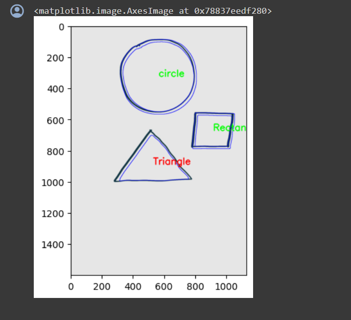

# ELC-Activity

  <h1>Shape Detection Model</h1>

  <h2>Overview</h2>
    
This project is the result of an Experimental Learning Activity (ELC) where I developed a shape detection model using Python. The model is capable of detecting various shapes within an image. It leverages libraries such as OpenCV, cv2, matplotlib, PIL, and numpy.

    <h2>Colab Notebook</h2>
    
You can find the implementation and usage of the shape detection model in the provided Colab notebook: <a href="Jaiditya_ELC_Activity.ipynb">Jaiditya_ELC_Activity.ipynb</a>

    <h2>Usage</h2>
    <ol>
        <li>Open the Colab notebook using the provided link.</li>
        <li>Follow the instructions within the notebook to run the shape detection model.</li>
        <li>Provide the path to the image you want to analyze.</li>
        <li>View the output image with detected shapes.</li>
    </ol>
    <h2>Working</h2>
    
The shape detection model follows these steps:

    <ol>
        <li><strong>Image Loading:</strong> Load the input image using the PIL library.</li>
        <li><strong>Preprocessing:</strong> Convert the image to grayscale and apply any necessary preprocessing steps.</li>
        <li><strong>Shape Detection:</strong> Utilize OpenCV and contour detection techniques to identify shapes within the image.</li>
        <li><strong>Visualization:</strong> Overlay the detected shapes on the original image for visualization.</li>
    </ol>
    <h2>Requirements</h2>
    <ul>
        <li>Python</li>
        <li>OpenCV</li>
        <li>cv2</li>
        <li>matplotlib</li>
        <li>PIL</li>
        <li>numpy</li>
    </ul>
    <h2>Examples</h2>
    

    
  <h2>Contributing</h2>
    
Contributions are welcome! Feel free to submit pull requests or open issues for any improvements or features you'd like to see.

